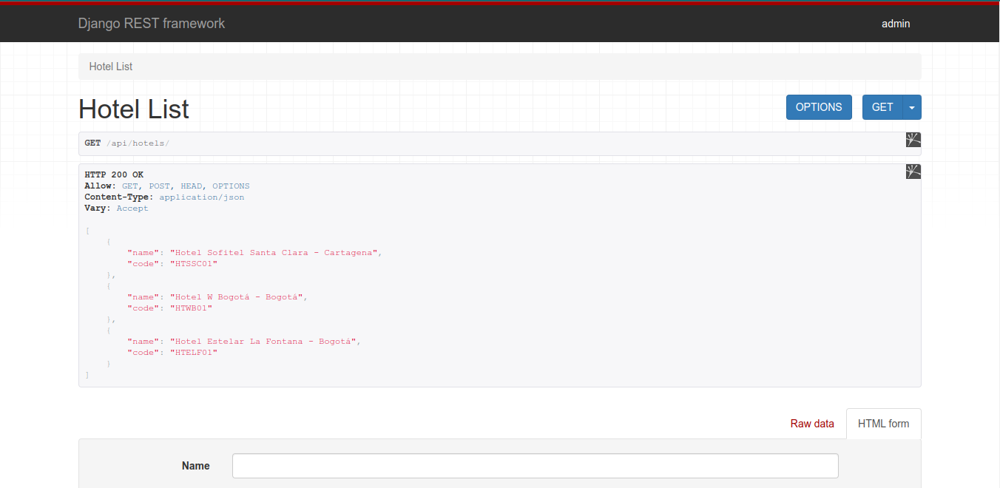
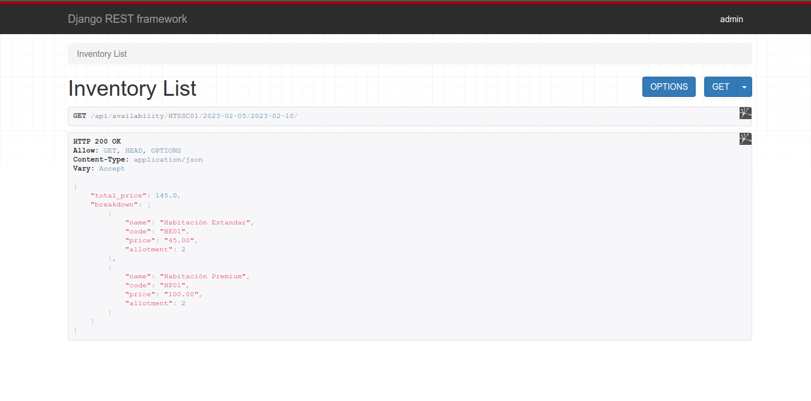
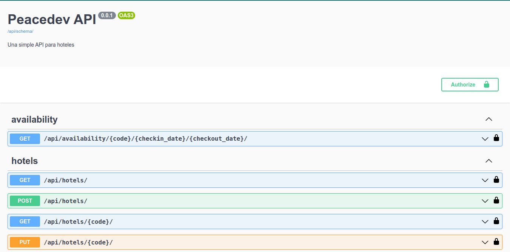

# Peacedev API

Prueba técnica para el puesto de Python Django Backend Developer, se trata de una API que genera endpoints para hoteles y la disponibilidad de habitaciones en esos hoteles.

## Construir proyecto

Para correr este proyecto existen tres formas, pero antes de debes clonar el repositorio.

Para clonar el repositorio ejecuta este comando:

```bash	
git clone https://github.com/alomia/peacedev-API.git
```

Ingresa al repositorio con el siguiente comando:

```bash
cd peacedev-API
```

### Manual:

1. Crear entorno virtual
   ```bash
   python -m venv .venv
   ```
2. Activar entorno virtual
   Linux:
   ```bash
   source .venv/bin/activate
   ```
   Windows:
   ```bash
   source .venv/Scripts/activate
   ```
3. Instalar dependencias
   ```bash
   pip install -r requirements.txt
   ```
4. Crear migraciones y aplicarlas
   ```bash
   python manage.py makemigrations
   ```
   ```bash
   python manage.py migrate
   ```
4. Cargar datos a la base de datos
   ```bash
   python manage.py loaddata hotel_data.json
   ```
5. Correr el servidor web
   ```bash
   python manage.py runserver
   ```


### Script:

En el directorio existe un script llamado `build.py`, el cual puedes ejecutar para construir y correr este proyecto.

```bash
./build.py
```

O

```bash
python build.py
```

### Docker:

Para correr este proyecto con Docker primero lo tienes que tener instalado y segundo correr este comando:

```bash
docker-compose up -d --build
```

Para detener o interrumpir la ejecución utiliza el siguiente comando:

```bash
docker-compose down
```


### Endpoints y Solicitudes:

Una vez el proyecto este corriendo podemos hacer solicitudes `http` a las diferentes `url` que nos otorga esta `API`:

##### Endpoints:

`http://localhost:8000/api/hotels/`

`http://localhost:8000/api/hotels/hotel_code/`

`http://localhost:8000/api/availability/hotel-code/checkin_date/checkout_date/`

##### Solicitudes:

*Solicitud `http` `GET` realizada con `curl` para ver las lista de todos los hoteles disponibles:*

```bash
$ curl -i -X GET http://localhost:8000/api/hotels/
HTTP/1.1 200 OK
Date: Sun, 29 Jan 2023 01:45:05 GMT
Server: WSGIServer/0.2 CPython/3.10.6
Content-Type: application/json
Vary: Accept, Origin, Cookie
Allow: GET, POST, HEAD, OPTIONS
X-Frame-Options: DENY
Content-Length: 183
X-Content-Type-Options: nosniff
Referrer-Policy: same-origin
Cross-Origin-Opener-Policy: same-origin

[{"name":"Hotel Sofitel Santa Clara - Cartagena","code":"HTSSC01"},{"name":"Hotel W Bogotá - Bogotá","code":"HTWB01"},{"name":"Hotel Estelar La Fontana - Bogotá","code":"HTELF01"}]
```

*Solicitud `http` `GET` realizada desde el navegador para ver las lista de todos los hoteles disponibles:*



*Solicitud `http` `GET` realizada con `curl` para ver la disponibilidad de habitaciones en el hotel:*

```bash
$ curl -i -X GET http://localhost:8000/api/availability/HTSSC01/2023-02-05/2023-02-10/
HTTP/1.1 200 OK
Date: Sun, 29 Jan 2023 01:51:17 GMT
Server: WSGIServer/0.2 CPython/3.10.6
Content-Type: application/json
Vary: Accept, Origin, Cookie
Allow: GET, HEAD, OPTIONS
X-Frame-Options: DENY
Content-Length: 187
X-Content-Type-Options: nosniff
Referrer-Policy: same-origin
Cross-Origin-Opener-Policy: same-origin

{"total_price":145.0,"breakdown":[{"name":"Habitación Estandar","code":"HE01","price":"45.00","allotment":2},{"name":"Habitación Premium","code":"HP01","price":"100.00","allotment":2}]}
```

*Solicitud `http` `GET` realizada desde el navegador para ver la disponibilidad de habitaciones en el hotel:*



## Documentación de la API

Para obtener mas información de esta `API` puedes ir a la siguiente `URL` :

`http://localhost:8000/api/schema/swagger-ui/`

